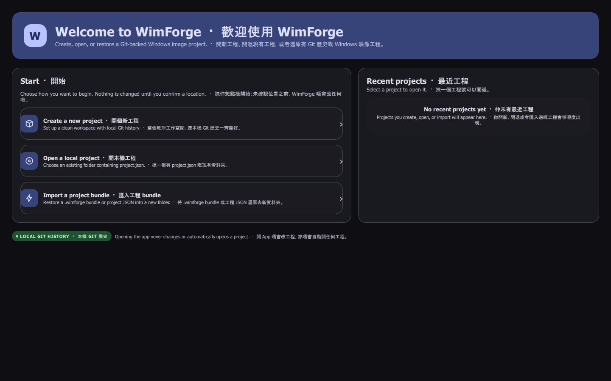
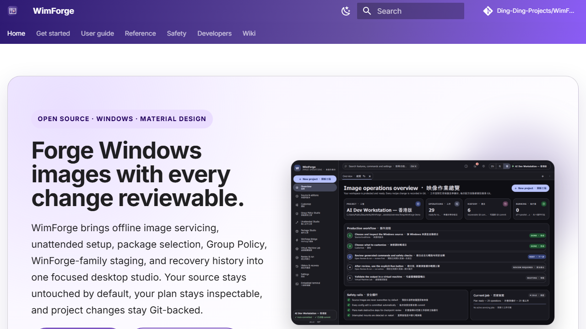
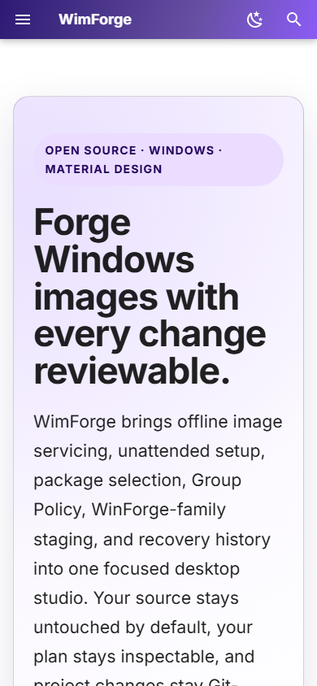

# Screenshot Gallery

These captures use route-specific, non-destructive demo or intentionally idle
states in bilingual English and Hong Kong Cantonese mode. Pages that would need
a live hypervisor or administrator shell remain safely unstarted.
Paths are intentionally neutral, every route uses the same viewport and
scale, and no real Windows image, product key, credential, or private project is
shown.

呢套截圖按頁面用唔會實際改映像嘅 demo 資料，或者刻意保持 idle 嘅安全狀態，預設同時顯示 English 同自然香港粵語。要真 hypervisor 或管理員 shell 嘅頁面唔會自動開工；所有路徑都係中性測試資料，亦唔會放真實 Windows 映像、product key、密碼或私人工程入鏡。

## Project Start / 工程起始頁

開啟 WimForge 會先到呢個類似 Visual Studio 嘅工程管理頁；你可以建立新工程、開啟現有資料夾、匯入 `.json` / `.wimforge`，或由最近工程清單繼續。

## Overview

## Source and editions

## Customize

## Group Policy Studio

## Unattended Studio

## Package Studio

## WinForge Bridge

## Virtual Machine Lab

## Review and run

## History and recovery

## Settings

## Embedded terminal

## Documentation site — desktop

## Documentation site — mobile

!!! info "Reproduce the gallery"
    Configure `build-capture` with
    `-DWIMFORGE_DOCUMENTATION_CAPTURE=ON`, build its Debug `WimForge` target,
    then run `scripts/capture-documentation-screenshots.ps1 -Language bilingual -Theme dark`. This restricted
    as-invoker harness accepts `--screenshot` with exactly one of `--demo` or
    `--project-start`; normal and release builds remain elevated. The script launches each route and saves a frame
    directly from its Qt Quick window. After the two documented site viewport
    captures, run `scripts/verify-documentation-screenshots.ps1` to enforce all
    fifteen names, true-PNG signatures, and exact dimensions.

    Launching the capture build without automated screenshot or project arguments opens an isolated interactive QA session with the safe demo; `--page`, `--language`, `--theme`, and `--customize-section` can choose its initial view.

    標準 app 畫廊用雙語同鎖定深色 theme 拍攝，輸出係 1,440×900、一個 logical pixel 對一個輸出 pixel；實體 DPI metadata 唔屬於合約。Capture build 冇帶自動截圖或工程參數時，會用安全 demo 開一個隔離嘅互動 QA session；可以用 `--page`、`--language`、`--theme` 同 `--customize-section` 揀起始畫面。之後亦要由同一個 commit 嘅本機 MkDocs build 重拍 desktop/mobile 兩張網站圖，全套十五張都要逐張核對，而且路徑一定要保持中性。
